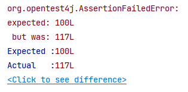

# 선착순 이벤트 시스템 실습
인프런에서 [실습으로 배우는 선착순 이벤트](https://www.inflearn.com/course/%EC%84%A0%EC%B0%A9%EC%88%9C-%EC%9D%B4%EB%B2%A4%ED%8A%B8-%EC%8B%9C%EC%8A%A4%ED%85%9C-%EC%8B%A4%EC%8A%B5/dashboard) 강의를 들으며 정리한 내용이다.

## 🙋 요구사항 정의
선착순 100명에게 할인 쿠폰을 제공하는 이벤트를 진행한다.

- 선착순 100명에게 쿠폰을 지급한다.
- 101개 이상이 지급되면 안된다.
- 순간적으로 몰리는 트래픽을 견딜 수 있어야 한다.

## 🚩 문제
[여러 명이 동시에 응모한다고 가정할 때](https://github.com/develop-hani/FCFS_coupon_system/commit/59f0761b8d5a0480f791191d4fde4e6b06d13bfa) 의도했던 100개보다 많은 쿠폰이 발급되는 것을 확인할 수 있다.

이는 <u>여러 스레드가 동시에 사용자들에게 쿠폰을 발급하는</u> **race condition**이 발생하였기 때문이다. 
 
 

### Lock을 통해 해결하면 되지 않나??
race condition이 발생했다는 점은 [재고시스템으로 알아보는 동시성 이슈](https://github.com/develop-hani/Stock_concurrency_issue) 와 같지만 MySQL이나 Redis로 lock을 걸어 해결하지 않는 이유는 다음과 같다.  
- lock의 범위  
    - 발급된 쿠폰 개수 가져오기 ⭢ 쿠폰 발급까지 **lock을 거는 구간이 길어** 성능 상의 불이익이 있을 수 있다.
    - 프로젝트의 핵심 키는 **쿠폰 개수**이므로 **쿠폰 수에 대한 정합성**만 맞추면 되므로 모든 구간에 락을 거는 것은 비효율적이다.