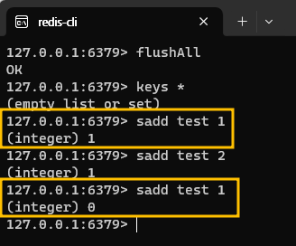
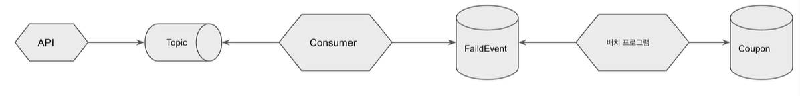

# 선착순 이벤트 시스템 실습
인프런에서 [실습으로 배우는 선착순 이벤트](https://www.inflearn.com/course/%EC%84%A0%EC%B0%A9%EC%88%9C-%EC%9D%B4%EB%B2%A4%ED%8A%B8-%EC%8B%9C%EC%8A%A4%ED%85%9C-%EC%8B%A4%EC%8A%B5/dashboard) 강의를 들으며 정리한 내용이다.

## 🙋 요구사항 정의
선착순 100명에게 할인 쿠폰을 제공하는 이벤트를 진행한다.

- 선착순 100명에게 쿠폰을 지급한다.
- 101개 이상이 지급되면 안된다.
- 순간적으로 몰리는 트래픽을 견딜 수 있어야 한다.
- 1인당 1개의 쿠폰만 발급받을 수 있다.

## 🚩 문제
[여러 명이 동시에 응모한다고 가정할 때](https://github.com/develop-hani/FCFS_coupon_system/commit/59f0761b8d5a0480f791191d4fde4e6b06d13bfa) 의도했던 100개보다 많은 쿠폰이 발급되는 것을 확인할 수 있다.

이는 <u>여러 스레드가 동시에 사용자들에게 쿠폰을 발급하는</u> **race condition**이 발생하였기 때문이다. 
 
 

### Lock을 통해 해결하면 되지 않나??
race condition이 발생했다는 점은 [재고시스템으로 알아보는 동시성 이슈](https://github.com/develop-hani/Stock_concurrency_issue) 와 같지만 MySQL이나 Redis로 lock을 걸어 해결하지 않는 이유는 다음과 같다.  
- lock의 범위  
    - 발급된 쿠폰 개수 가져오기 ⭢ 쿠폰 발급까지 **lock을 거는 구간이 길어** 성능 상의 불이익이 있을 수 있다.
    - 프로젝트의 핵심 키는 **쿠폰 개수**이므로 **쿠폰 수에 대한 정합성**만 맞추면 되므로 모든 구간에 락을 거는 것은 비효율적이다.

## 💾 Redis를 이용한 해결 방법
redis 통해 해결할 수 있는 이유는 다음과 같다.
- redis는 **싱글스레드 기반**으로 동작하므로 race condition을 해결할 수 있다.
- `incr` 명령어의 성능이 좋다.  
  (※ `incr` 명령어는 key에 대한 value를 1씩 증가시킨다.)

### 결과
[ApplyService.java](https://github.com/develop-hani/FCFS_coupon_system/blob/master/api/src/main/java/com/practice/api/service/ApplyService.java) 에서 쿠폰의 수를 redis increment()통해 가져올 때 
`long count = countCouponRepository.increment()` 테스트 케이스가 성공적으로 실행되는 것을 확인할 수 있다.

### 발생할 수 있는 문제점
- 발급하는 쿠폰의 수가 많아질수록 **RDB에 부하**를 줄 수 있다.
  - 1분에 100개의 insert만 가능하다고 가정할 때,
  
    |Time|Request|
    |---|---|
    |10:00|쿠폰 발급 10,000개 요청|
    |10:01|주문 생성 요청|
    |10:02|회원 가입 요청|
  - 이 경우 주문 생성과 회원 가입 요청은 쿠폰이 모두 발급된 이후 가능한다.  
   
  
  ⇒ RDB에 쿠폰을 발급하는 DB와 다른 DB를 함께 사용한다면 **다른 서비스에도 영향**을 줄 수 있다.  
  ⇒ **time-out이 설정**되어있는 대부분의 서비스를 고려한다면, 주문 생성, 회원가입 요청은 물론 일부 쿠폰도 정상적으로 발급되지 않는 문제가 발생할 수 있다.

## 📢 Kafka를 이용한 해결 방법
Redis와 함께 카프카를 사용한다면 RDB의 부하를 줄일 수 있다.  

1. docker-compose로 kafka container를 실행한다.
    - [docker-compose.yml](/kafka/docker-compose.yml)
    - `docker-compose up -d`
2. `coupon_create`라는 **topic을 생성**하여 해당 topic을 통해 데이터를 produce하고 consume할 수 있도록 한다.
    - `docker exec -it kafka kafka-topics.sh --bootstrap-server localhost:9092 --create --topic coupon_createdocker exec -it kafka kafka-topics.sh --bootstrap-server localhost:9092 --create --topic coupon_create`
    - consumer를 실행하고 싶다면 아래 명령어를 사용하면 된다.
      - `docker exec -it kafka kafka-console-consumer.sh --topic coupon_create --bootstrap-server localhost:9092 --key-deserializer "org.apache.kafka.common.serialization.StringDeserializer" --value-deserializer "org.apache.kafka.common.serialization.LongDeserializer"`
3. [Kafka에 **데이터를 produce하기 위한 설정**](https://github.com/develop-hani/FCFS_coupon_system/blob/master/api/src/main/java/com/practice/api/config/KafkaProducerConfig.java)을 한 뒤, `kafkaTemplate`을 이용하여 [`coupon_create` 토픽으로 데이터를 전달](https://github.com/develop-hani/FCFS_coupon_system/blob/master/api/src/main/java/com/practice/api/producer/CouponCreateProducer.java)할 수 있도록 한다.
4. [Kafka에서 **데이터를 consume할 수 있는 설정**](https://github.com/develop-hani/FCFS_coupon_system/blob/master/consumer/src/main/java/com/practice/consumer/config/KafkaConsumerConfig.java)을 한 뒤, [consumer로 들어온 데이터를 받아 쿠폰을 발행](https://github.com/develop-hani/FCFS_coupon_system/blob/master/consumer/src/main/java/com/practice/consumer/consumer/CouponCreatedConsumer.java)할 수 있도록 한다. 

### 테스트 실행 시 주의할 점
Testcase에서는 데이터를 모두 송신하였지만 consumer는 아직 데이터를 처리 중일 수 있다.

|Time|Test case|Producer|Consumer|
|---|---|---|---|
|10:00|테스트 케이스 시작| |데이터 수신 중..|
|10:01| |데이터 전송 완료| 데이터 처리..|
|10:02 |테스트 케이스 종료| |데이터 처리..|
|10:02| | |데이터 처리..|
|10:04| | |데이터 처리 완료|

Testcode에 Thread가 대기할 수 있도록 하여 consumer가 데이터 처리를 완료할 때까지 기다리도록 한다. 
`Thread.sleep(10000);`

### 장·단점
**장점**
- API에서 직접 쿠폰을 생성할 때에 비해서 **처리량을 조절**할 수 있다.
- 따라서 **데이터베이스의 부하를 줄**일 수 있다.

**단점**
- 쿠폰 생성까지 약간의 텀이 발생할 수 있다.

## ➕ 요구사항 추가: 1인당 1개의 쿠폰만 발급받을 수 있다.
### 시도해볼 수 있는 방법들
1. Unique 조건 사용 
  - 쿠폰테이블의 userId와 couponType에 unique 조건을 걸어 쿠폰이 1개만 생성되도록 **데이터베이스 레벨에서 막**는다.
  - 보통 서비스에서 한 유저가 같은 타입의 쿠폰을 여러 개 가질 수도 있으므로 실용적인 방법 X
2. [쿠폰을 발행하는 범위](https://github.com/develop-hani/FCFS_coupon_system/blob/master/api/src/main/java/com/practice/api/service/ApplyService.java#L23)에 lock 걸기
   - 쿠폰을 발급할 때 lock을 걸고, 발급이 완료되면 lock을 해제한다.
   - 쿠폰을 발급하기 전에 `if (발급되었다면) return;`하여 중복 발급을 막을 수 있다.
   - api에서는 쿠폰 발급 여부만 확인하고 실제 쿠폰 발급은 consumer에서 진행하고 있는데, 그 사이에 **시간 차이때문에 쿠폰이 1개만 발급된다는 것을 보장할 수 없**다.
   - api에서 쿠폰을 발급하게되면, **lock의 범위가 너무 길**어진다.
3. <u>자료구조 확인하기</u>
    - **set을 활용**하면 중복 저장이 불가능하고, 요소의 존재 여부도 빠르게 파악할 수 있다.
    - redis에서도 set을 지원하므로 이번 프로젝트에서는 redis를 활용한다.

### redis에서 set 활용하기
`sadd` 명령어를 활용하여 test라는 key에 value로 자료구조를 넣고있다.

## ⚠️Consumer에서 error 발생 시 처리 방법
consumer에서 에러가 발생한다면, 실제로 쿠폰을 발급되지 않았는데 발급된 쿠폰의 개수만 올라가는 문제가 생길 수 있다. 

⇒ 오류 발생 시, **백업 데이터와 로그**를 남기도록한다.

  

이번 프로젝트에서는 로그를 남기고 FailedEvent에 쿠폰이 발급되지 않은 사용자의 id만 남기도록 하였지만 
**배치프로그램**에서 주기적으로 FailedEvent를 읽어와 Coupon을 발급 받게 한다면 주어진 문제를 해결할 수 있다.
